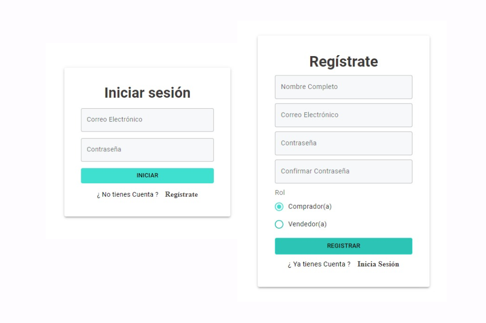
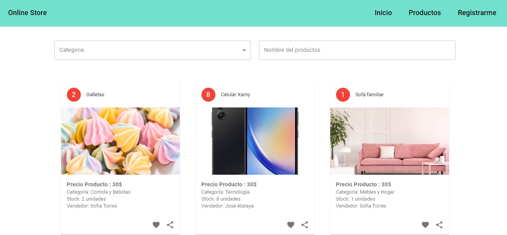

# Tienda Online con Material-UI

¡Bienvenidos! Este un proyecto que ofrece una plataforma para la compra y venta de una amplia variedad de artículos. Este proyecto está desarrollado con React y utiliza Material-UI para construir una interfaz de usuario moderna y atractiva.

## Funcionalidades Clave

-   **Autenticación y Registro:**

    -   El proyecto cuenta con un formulario de autenticación que permite a los usuarios iniciar sesión.
    -   El registro ofrece opciones para seleccionar entre el rol de vendedor o comprador.

-   **Firebase:**

    -   La autenticación y el almacenamiento seguro de contraseñas se gestionan mediante Firebase Authentication.
    -   Las contraseñas se encriptan utilizando bcryptjs antes de almacenarse en Firebase.

-   **Material-UI:**
    -   La interfaz de usuario utiliza la biblioteca Material-UI para obtener componentes visualmente atractivos y consistentes.

## Tecnologías Utilizadas

-   React: Desarrollado utilizando la biblioteca de interfaz de usuario React.
-   Firebase: Utilizado para la autenticación segura y el almacenamiento de datos sensibles.
-   bcryptjs: Implementado para la encriptación segura de contraseñas.
-   Material-UI: Utilizado para la construcción de la interfaz de usuario.

## Capturas de Pantalla

### Pantalla de Inicio de Sesión y Registro de Usuario

### Interfaz de Productos

### Visita la [Interfaz de Usuario 🛍️](https://store-with-material-ui.vercel.app/) (haz clic derecho y selecciona "Abrir enlace en una nueva pestaña" para una mejor experiencia).
